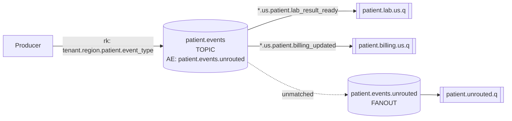

# Topology Notes

## Redesigned routing



## Routing-key convention

Patient events are published to `patient.events` using this topic routing key shape:

```text
<tenant>.<region>.patient.<event_type>
```

Examples:

- `westcare.us.patient.lab_result_ready`
- `eastcare.us.patient.billing_updated`
- `westcare.eu.patient.lab_result_ready`

## Queue bindings

- `patient.lab.us.q` is bound to `patient.events` with `*.us.patient.lab_result_ready`.
  - It receives lab-result-ready events for the US region for any tenant.
- `patient.billing.us.q` is bound to `patient.events` with `*.us.patient.billing_updated`.
  - It receives billing-updated events for the US region for any tenant.
- `patient.unrouted.q` is bound to `patient.events.unrouted`, a durable fanout alternate exchange.
  - Any message published to `patient.events` that does not match a real consumer binding is forwarded to this queue instead of being dropped.

## Message properties

Producers should publish JSON payloads with consistent AMQP metadata:

- `content_type`: `application/json`
- `correlation_id`: a unique trace identifier for the publication/request path
- `type`: logical message family, currently `patient.event`

The included `seed.sh` script follows this convention.

## Expected seed result from empty queues

Running `./seed.sh` once against empty queues should produce:

- `patient.lab.us.q`: 2 messages
- `patient.billing.us.q`: 2 messages
- `patient.unrouted.q`: 3 messages

Because all exchanges and queues are durable and are loaded from `definitions.json`, the topology remains intact after broker restart with the same definitions file.
